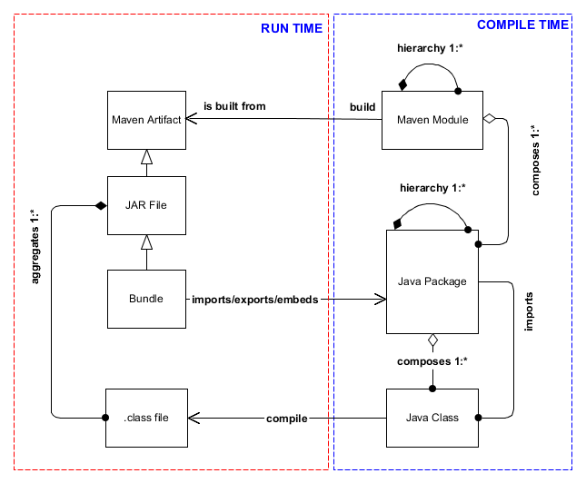
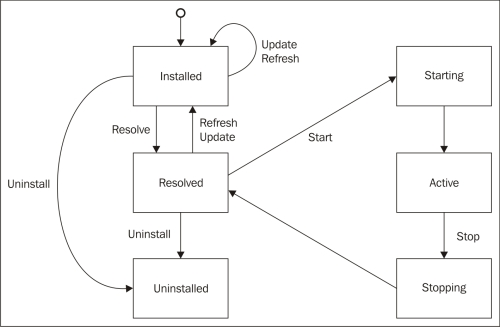

# Bundles

* Bundles are the unit of modularity in OSGi
* They are also a kind of JAR file
* As files, bundles are physical modules. Bundles can be moved or copied. Contrast with packages, which are logical modules
* A bundle is just a JAR file with special headers in its `MANIFEST.MF` file

## Grouping Things: modules, bundles, packages, and artifacts
* Modules - Maven compile-time construct
* Artifacts - Maven run-time construct
* Packages - Java compile-time construct
* JARs - JRE run-time construct
* Bundles - OSGi run-time construct

These constructs have a loose relationship to each other. If I had to draw a UML diagram of it, it would look like this:



* JAR files are a kind of Maven artifact
* Bundle are a kind of JAR file
* Bundles can import, export, or embed packages
* Maven builds modules into artifacts
* Maven modules can be nested
* Packages can be nested
* Maven modules can contain multiple packages
* Classes are .java files
* Packages can import classes from other packages
* Classes belong to a package

## Bundle Lifecycle


## Maven & Maven-Bundle-Plugin
* Maven builds the JAR files
* Maven-Bundle-Plugin generates the special headers in the `MANIFEST.MF` file

## Using the maven-bundle-plugin
### Add the maven-bundle-plugin to the list of plugins
```xml
<build>
    ...
    <plugins>
        ...
        <plugin>
            <groupId>org.apache.felix</groupId>
            <artifactId>maven-bundle-plugin</artifactId>
             <version>3.2.0</version>
        </plugin>
    </plugins>
</build>
```

### Enable extension for the maven-bundle-plugin
```xml
<plugin>
    ...
    <extensions>true</extensions>
</plugin>
```

### Change or add the pom's packaging to `bundle`
```xml
<project>
    ...
    <packaging>bundle</packaging>
    ...
</project>
```

### Configuring maven-bundle-plugin
The current configuration is the bare minimum to produce an OSGI bundle. Currently it uses all the 
defaults for the maven-bundle-plugin which are the following:

**NOTE** These arn't all the instructions, you can use any OSGI manifest header here. These are just the ones that have a default value

Option | Default Value
------ | -------------
Bundle-Symbolic-name | `${project.groupId}` + . + `${project.artifactId}`
Export-Package | All packages except package-default, *.impl, *.internal
Private-Package | All packages not specified in Export-Package. **NOTE**: if a package is specified in Export-Package and Private-Package it will be *exported*
Import-Package | All packages (*), which imports all packages referenced by the bundle content but not contained in it. **NOTE** Any exported packages are also imported by default, to ensure a consistent class space.
Include-Resource | Generated from the projects maven resources (typically `src/main/resources`)
Bundle-Version | `${pom.version}` but normalized to the OSGI format of `MAJOR.MINOR.MICRO.QUALIFIER`
Bundle-Name | `${pom.name}`
Bundle-Description | `${pom.description}`
Bundle-License | `${pom.licenses}`
Bundle-Vendor | `${pom.organization.name}`
Bundle-DocURL | `${pom.organization.url}`

To change any of these values just add them to the plugins `configuration/instructions` element
```xml
<plugin>
    ...
    <configuration>
        <instructions>
            <Export-Package>com.connexta.api</Export-Package>
            <Private-Package>com.connexta.impl</Private-Package>
        </instructions>
    </configuration>
</plugin>
```

## How to install a bundle in karaf
* `bundle:install file://{bundle_folder}/filename.jar`
* `bundle:install mvn:{group ID}/{artifact ID}/{version}`
* Copy the JAR file to Karaf's `deploy` directory

When a bundle is installed it is copied to a cache and is always loaded from the cache. 

### Preferred to install a bundle
* Use the Maven address

## Karaf Shell 

#### Common bundle commands
* `bundle:install` mavenUrls
    * Installs a list of bundles into karaf
    * Can add the `--start` or `-s` flag to start the bundle when installed
* `bundle:start` ids
    * Starts the list of bundle ids
* `bundle:update` id [location]
    * Updates an installed bundle using the local maven repo
    * Can specify where to get the updated bundle from
* `bundle:headers` ids
    * Displays detailed OSGI information of given bundles. Such as when they import/export and whether or not they are satisfied
* `bundle:watch` ids (or maven urls)
    * Watches for updates to the specified bundles and automatically updates them
    * Add `--start` to start watching the specified bundles.
    * `--stop` to stop the specified bundles
    * `--remove` to remove the specified bundles
    * `--list` to show the currently watched bundles
